# HR模块产品文档

## 1. 模块概述

HR（人力资源）模块是ERP系统的核心组件之一，负责企业员工全生命周期的管理。该模块涵盖了员工信息管理、组织结构设置、职位管理、技能评估、合同管理、离职处理等全面的人力资源管理功能，为企业提供高效、规范的人事管理解决方案。

### 核心功能亮点

- **员工全生命周期管理**：从入职到离职的完整记录和流程支持
- **灵活的组织结构**：支持多层级部门设置和汇报关系管理
- **技能与能力管理**：技能分类、评估和员工能力匹配
- **多地点办公支持**：灵活的工作地点配置和每日位置管理
- **合同与合规管理**：合同类型配置和工作许可证管理
- **详细的员工档案**：包含个人信息、联系方式、教育背景、紧急联系人等全面信息

## 2. 实体表结构与功能详解

### 2.1 核心员工管理实体

#### 2.1.1 员工信息表 (hr_employee)

该表是HR模块的核心，存储所有员工的详细信息。

| 字段名 | 数据类型 | 描述 |
|-------|---------|------|
| id | int | 员工ID，主键 |
| resource_id | int | 资源ID，关联资源表 |
| company_id | int | 公司ID，关联公司表 |
| user_id | int | 用户ID，关联用户表 |
| parent_id | int | 管理者ID，自关联，表示直接上级 |
| coach_id | int | 指导者ID，关联其他员工 |
| name | varchar | 员工姓名 |
| work_phone | varchar | 工作电话 |
| mobile_phone | varchar | 工作手机 |
| work_email | varchar | 工作邮箱 |
| legal_name | varchar | 法律名称 |
| private_phone | varchar | 私人电话 |
| private_email | varchar | 私人邮箱 |
| birthday | datetime | 出生日期 |
| place_of_birth | varchar | 出生地 |
| country_of_birth | int | 出生国家ID |
| permit_no | varchar | 工作许可证号 |
| visa_no | varchar | 签证号 |
| visa_expire | datetime | 签证到期日期 |
| work_permit_expiration_date | datetime | 工作许可证到期日期 |
| certificate | varchar | 证书等级 |
| study_field | varchar | 学习领域 |
| study_school | varchar | 毕业学校 |
| emergency_contact | varchar | 紧急联系人 |
| emergency_phone | varchar | 紧急联系电话 |
| barcode | varchar | 工牌条形码/ID |
| pin | varchar | 个人识别码 |
| salary_distribution | jsonb | 薪资分配配置 |
| active | boolean | 是否在职 |
| monday_location_id 到 sunday_location_id | int | 每周各天的工作地点配置 |

#### 2.1.2 员工版本表 (hr_version)

管理员工信息的版本历史，支持员工档案变更追踪。

| 字段名 | 数据类型 | 描述 |
|-------|---------|------|
| id | int | 版本ID，主键 |
| employee_id | int | 员工ID，关联员工表 |
| date | datetime | 版本日期 |

#### 2.1.3 员工类别表 (hr_employeecategory)

定义员工分类，用于员工分组和权限控制。

| 字段名 | 数据类型 | 描述 |
|-------|---------|------|
| id | int | 类别ID，主键 |
| name | jsonb | 类别名称（多语言支持） |

### 2.2 组织结构管理

#### 2.2.1 部门表 (hr_department)

管理企业的部门结构，支持多级部门设置。

| 字段名 | 数据类型 | 描述 |
|-------|---------|------|
| id | int | 部门ID，主键 |
| company_id | int | 公司ID，关联公司表 |
| parent_id | int | 父部门ID，支持多级部门结构 |
| manager_id | int | 部门经理ID，关联员工表 |
| master_department_id | int | 主部门ID |
| name | varchar | 部门名称 |

#### 2.2.2 职位表 (hr_job)

定义企业内的职位信息，支持招聘目标设置。

| 字段名 | 数据类型 | 描述 |
|-------|---------|------|
| id | int | 职位ID，主键 |
| sequence | int | 排序序号 |
| no_of_recruitment | int | 招聘目标人数 |
| user_id | int | 招聘负责人ID |
| department_id | int | 所属部门ID |
| company_id | int | 公司ID |
| contract_type_id | int | 合同类型ID |
| name | varchar | 职位名称 |

#### 2.2.3 工作地点表 (hr_worklocation)

管理企业的工作地点信息，支持多地点办公。

| 字段名 | 数据类型 | 描述 |
|-------|---------|------|
| id | int | 工作地点ID，主键 |
| company_id | int | 公司ID |
| address_id | int | 地址ID |
| name | varchar | 工作地点名称 |
| location_type | varchar | 地点类型 |
| location_number | varchar | 地点编号 |
| active | boolean | 是否激活 |

### 2.3 技能与能力管理

#### 2.3.1 技能表 (hr_skill)

定义企业认可的技能类型。

| 字段名 | 数据类型 | 描述 |
|-------|---------|------|
| id | int | 技能ID，主键 |
| sequence | int | 排序序号 |
| skill_type_id | int | 技能类型ID |
| name | jsonb | 技能名称（多语言支持） |

#### 2.3.2 技能类型表 (hr_skilltype)

对技能进行分类管理。

| 字段名 | 数据类型 | 描述 |
|-------|---------|------|
| id | int | 技能类型ID，主键 |
| name | jsonb | 类型名称（多语言支持） |

#### 2.3.3 技能等级表 (hr_skilllevel)

定义技能的评估等级。

| 字段名 | 数据类型 | 描述 |
|-------|---------|------|
| id | int | 等级ID，主键 |
| name | jsonb | 等级名称（多语言支持） |

#### 2.3.4 员工技能关系表 (hr_employeehrskillrel)

关联员工与技能的多对多关系。

| 字段名 | 数据类型 | 描述 |
|-------|---------|------|
| hr_employee_id | int | 员工ID |
| hr_skill_id | int | 技能ID |

#### 2.3.5 职位技能关系表 (hr_jobskill)

定义职位所需的技能要求。

| 字段名 | 数据类型 | 描述 |
|-------|---------|------|
| id | int | 关系ID，主键 |
| job_id | int | 职位ID |
| skill_id | int | 技能ID |
| skill_level_id | int | 所需技能等级ID |

### 2.4 合同与离职管理

#### 2.4.1 合同类型表 (hr_contracttype)

定义企业使用的各类合同模板。

| 字段名 | 数据类型 | 描述 |
|-------|---------|------|
| id | int | 合同类型ID，主键 |
| sequence | int | 排序序号 |
| country_id | int | 国家ID，支持多国家合同 |
| code | varchar | 合同代码 |
| name | jsonb | 合同名称（多语言支持） |

#### 2.4.2 离职原因表 (hr_departurereason)

定义员工离职的各类原因。

| 字段名 | 数据类型 | 描述 |
|-------|---------|------|
| id | int | 原因ID，主键 |
| sequence | int | 排序序号 |
| country_id | int | 国家ID |
| name | jsonb | 原因名称（多语言支持） |

#### 2.4.3 离职向导表 (hr_departurewizard)

管理离职流程向导配置。

| 字段名 | 数据类型 | 描述 |
|-------|---------|------|
| id | int | 向导ID，主键 |
| departure_reason_id | int | 离职原因ID |
| departure_date | datetime | 离职日期 |

#### 2.4.4 员工离职关系表 (hr_departurewizardhremployeerel)

关联离职向导与员工的关系。

| 字段名 | 数据类型 | 描述 |
|-------|---------|------|
| hr_departurewizard_id | int | 离职向导ID |
| hr_employee_id | int | 员工ID |

### 2.5 简历与经历管理

#### 2.5.1 简历行表 (hr_resumeline)

记录员工的教育和工作经历详情。

| 字段名 | 数据类型 | 描述 |
|-------|---------|------|
| id | int | 记录ID，主键 |
| employee_id | int | 员工ID |
| duration | int | 经历持续时间 |
| line_type_id | int | 记录类型ID（教育/工作经历等） |
| course_type | varchar | 课程类型（针对教育经历） |
| external_url | varchar | 外部链接 |
| name | varchar | 经历名称（学校/公司名称） |
| date_start | datetime | 开始日期 |
| date_end | datetime | 结束日期 |

#### 2.5.2 简历行类型表 (hr_resumelinetype)

定义简历记录的类型分类。

| 字段名 | 数据类型 | 描述 |
|-------|---------|------|
| id | int | 类型ID，主键 |
| name | jsonb | 类型名称（多语言支持） |

#### 2.5.3 员工简历向导表 (hr.employeecvwizard)

管理员工简历的导入和编辑向导。

| 字段名 | 数据类型 | 描述 |
|-------|---------|------|
| id | int | 向导ID，主键 |
| resume_filename | varchar | 简历文件名 |

### 2.6 薪资与财务相关

#### 2.6.1 薪资结构类型表 (hr_payrollstructuretype)

定义企业使用的薪资结构模板。

| 字段名 | 数据类型 | 描述 |
|-------|---------|------|
| id | int | 结构类型ID，主键 |
| name | jsonb | 结构名称（多语言支持） |

#### 2.6.2 银行账户分配向导表 (hr_bankaccountallocationwizard)

管理员工银行账户分配的向导流程。

| 字段名 | 数据类型 | 描述 |
|-------|---------|------|
| id | int | 向导ID，主键 |
| journal_id | int | 日记账ID |

#### 2.6.3 银行账户分配明细行表 (hr_bankaccountallocationwizardline)

存储银行账户分配的具体明细。

| 字段名 | 数据类型 | 描述 |
|-------|---------|------|
| id | int | 明细ID，主键 |
| wizard_id | int | 向导ID |
| employee_id | int | 员工ID |
| amount | numeric | 分配金额 |

### 2.7 其他辅助实体

#### 2.7.1 员工位置表 (hr_employeelocation)

记录员工的工作位置信息。

| 字段名 | 数据类型 | 描述 |
|-------|---------|------|
| id | int | 位置ID，主键 |
| employee_id | int | 员工ID |
| date | date | 日期 |
| location_id | int | 工作地点ID |

## 3. 实体关系图

```mermaid
graph TD
    subgraph 核心员工管理
        Employee["员工 (hr_employee)"]
        Version["员工版本 (hr_version)"]
        Category["员工类别 (hr_employeecategory)"]
    end

    subgraph 组织结构
        Department["部门 (hr_department)"]
        Job["职位 (hr_job)"]
        WorkLocation["工作地点 (hr_worklocation)"]
    end

    subgraph 技能管理
        Skill["技能 (hr_skill)"]
        SkillType["技能类型 (hr_skilltype)"]
        SkillLevel["技能等级 (hr_skilllevel)"]
        EmployeeSkillRel["员工-技能关系 (hr_employeehrskillrel)"]
        JobSkill["职位-技能关系 (hr_jobskill)"]
    end

    subgraph 合同与离职
        ContractType["合同类型 (hr_contracttype)"]
        DepartureReason["离职原因 (hr_departurereason)"]
        DepartureWizard["离职向导 (hr_departurewizard)"]
        DepartureWizardEmployeeRel["离职向导-员工关系 (hr_departurewizardhremployeerel)"]
    end

    subgraph 简历管理
        ResumeLine["简历行 (hr_resumeline)"]
        ResumeLineType["简历行类型 (hr_resumelinetype)"]
        EmployeeCVWizard["员工简历向导 (hr_employeecvwizard)"]
    end

    Employee --> Department
    Employee --> Job
    Employee --> WorkLocation
    Employee --> EmployeeSkillRel
    Employee --> ResumeLine
    Employee --> Version
    Employee --> DepartureWizardEmployeeRel
    
    Department --> Employee
    Department --> Department
    
    Job --> Department
    Job --> ContractType
    Job --> JobSkill
    
    Skill --> SkillType
    Skill --> EmployeeSkillRel
    Skill --> JobSkill
    
    JobSkill --> SkillLevel
    
    DepartureWizard --> DepartureReason
    DepartureWizard --> DepartureWizardEmployeeRel
    
    ResumeLine --> ResumeLineType
    
    WorkLocation --> Employee
```

## 4. 主要业务流程

### 4.1 员工入职流程

1. 创建员工基本信息（hr_employee表）
2. 分配部门和职位（关联hr_department和hr_job）
3. 设置工作地点（关联hr_worklocation）
4. 记录个人详细信息和联系方式
5. 添加教育和工作经历（hr_resumeline）
6. 录入技能信息（通过hr_employeehrskillrel关联）
7. 创建薪资分配配置
8. 设置管理者和指导者关系

### 4.2 员工信息变更流程

1. 创建员工版本记录（hr_version）
2. 更新员工信息（hr_employee）
3. 如涉及部门变更，更新部门关联
4. 如涉及技能变更，更新技能关系
5. 更新工作地点配置

### 4.3 员工离职流程

1. 创建离职向导（hr_departurewizard）
2. 选择离职原因（关联hr_departurereason）
3. 设置离职日期
4. 将员工标记为非活跃状态
5. 处理薪资结算（通过银行账户分配向导）

### 4.4 技能评估与职位匹配流程

1. 定义技能类型和等级标准（hr_skilltype, hr_skilllevel）
2. 为职位设置技能要求（hr_jobskill）
3. 记录员工技能（hr_employeehrskillrel）
4. 系统可根据技能匹配度推荐职位或人才

## 5. 特色功能

### 5.1 灵活的工作地点管理

- 支持员工每周7天不同的工作地点配置
- 支持远程办公、混合办公模式
- 实时显示员工当天工作地点

### 5.2 完善的合规管理

- 工作许可证和签证管理
- 到期提醒功能
- 支持多国家法规要求的合同类型

### 5.3 技能矩阵与人才管理

- 可视化技能评估
- 职位-技能匹配分析
- 培训需求识别

### 5.4 员工全生命周期追踪

- 完整的入职到离职记录
- 员工版本历史管理
- 详细的简历和经历记录

## 6. 技术实现要点

### 6.1 多语言支持

多个实体使用jsonb类型存储多语言名称和配置，支持国际化：
- hr_skill.name
- hr_skilltype.name
- hr_resumelinetype.name
- hr_contracttype.name
- hr_departurereason.name

### 6.2 灵活的配置存储

使用jsonb类型存储复杂的配置信息：
- hr_employee.salary_distribution：薪资分配配置
- hr_employee.employee_properties：员工自定义属性

### 6.3 关系模型设计

- 使用自关联实现部门层级结构和员工汇报关系
- 采用多对多关系表管理复杂的关联（如员工-技能）
- 丰富的外键关联确保数据完整性

### 6.4 安全性考虑

- 敏感字段加密存储（如个人识别码PIN）
- 灵活的权限控制基于员工类别
- 隐私信息管理（如私人联系方式）

## 7. 扩展与集成

HR模块与系统其他模块有紧密集成：

- 与认证模块集成：通过user_id关联用户账户
- 与财务模块集成：通过bankaccountallocationwizard处理薪资发放
- 与项目模块集成：员工可作为项目成员参与项目
- 与CRM模块集成：员工可作为客户联系人的负责人

## 8. 性能优化建议

- 对频繁查询的字段（如部门ID、员工活跃状态）建立索引
- 针对大型组织，考虑部门结构缓存机制
- 对历史数据进行归档，保持活跃员工数据的查询效率
- 优化技能匹配算法，提高人才搜索性能