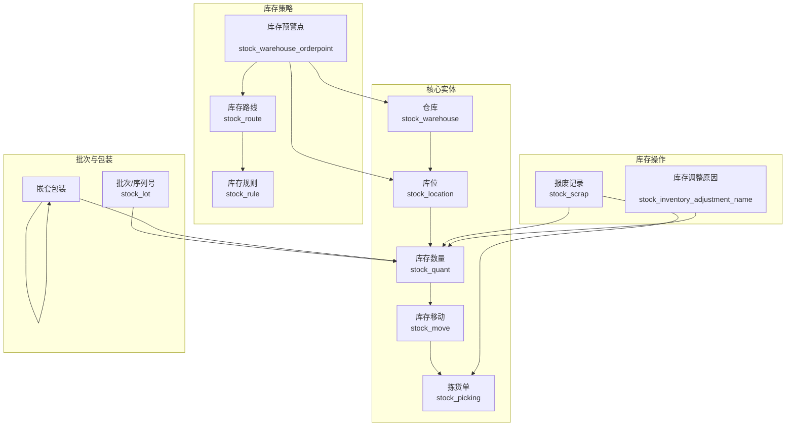

# 库存管理模块（Stock）产品文档

## 1. 模块概述

库存管理模块（Stock）是ERP系统的核心模块之一，负责企业所有库存资源的全面管理和追踪。该模块提供了从原材料采购入库到产品销售出库的完整库存生命周期管理，包括库存水平监控、库存移动记录、库位管理、批次跟踪、包装管理以及库存预警等功能。通过精确的库存数据和自动化的业务流程，帮助企业优化库存水平、提高库存周转率并减少库存损失。

### 主要功能特点
- **多仓库多库位支持**：灵活管理多个仓库及其内部的层级库位结构
- **实时库存追踪**：通过Quants机制精确记录每个产品在各库位的库存数量
- **完整的库存移动记录**：追踪所有库存移动，包括入库、出库、调拨、报废等
- **批次和序列号管理**：支持产品批次和序列号的跟踪，确保产品溯源
- **智能补货系统**：基于库存预警点自动生成补货建议
- **包装管理**：支持多层级包装结构，便于物流管理和库存盘点
- **库存报表与分析**：提供丰富的库存分析报表，支持决策制定

## 2. 实体表结构与功能详解

### 2.1 核心库存管理实体

#### 2.1.1 仓库管理 (stock_warehouse)

| 字段名 | 类型 | 描述 |
|-------|------|------|
| id | int | 仓库ID |
| company_id | int | 公司ID |
| partner_id | int | 地址/合作伙伴ID |
| view_location_id | int | 视图位置ID（顶层位置） |
| lot_stock_id | int | 库存位置ID |
| wh_input_stock_loc_id | int | 输入位置ID（收货区） |
| wh_qc_stock_loc_id | int | 质检位置ID |
| wh_output_stock_loc_id | int | 输出位置ID（发货区） |

**功能描述**：仓库是库存管理的最高级组织单位，每个仓库包含多个预设的库位（如收货区、质检区、发货区和库存区），定义了企业的库存存储空间结构。

#### 2.1.2 库位管理 (stock_location)

| 字段名 | 类型 | 描述 |
|-------|------|------|
| id | int | 库位ID |
| location_id | int | 父库位ID（支持层级结构） |
| company_id | int | 公司ID |
| removal_strategy_id | int | 移除策略ID |
| cyclic_inventory_frequency | int | 周期性盘点频率 |
| warehouse_id | int | 所属仓库ID |
| storage_category_id | int | 存储类别ID |

**功能描述**：库位代表物理存储空间的具体位置，支持树形层级结构，允许企业灵活定义仓库内的存储布局，如区域、货架、货位等。

#### 2.1.3 库存数量 (stock_quant)

| 字段名 | 类型 | 描述 |
|-------|------|------|
| id | int | 库存数量记录ID |
| product_id | int | 产品ID |
| company_id | int | 公司ID |
| location_id | int | 库位ID |
| lot_id | int | 批次/序列号ID |
| package_id | int | 包装ID |
| owner_id | int | 所有者ID |
| user_id | int | 负责人ID |

**功能描述**：库存数量记录是库存管理的核心，精确记录每个产品在特定库位的具体数量，支持批次、包装和所有者维度的跟踪，是库存准确性的基础。

#### 2.1.4 库存移动 (stock_move)

| 字段名 | 类型 | 描述 |
|-------|------|------|
| id | int | 移动ID |
| sequence | int | 排序序号 |
| company_id | int | 公司ID |
| product_id | int | 产品ID |
| product_uom | int | 计量单位ID |
| location_id | int | 源库位ID |
| location_dest_id | int | 目标库位ID |
| location_final_id | int | 最终库位ID |
| partner_id | int | 合作伙伴ID |

**功能描述**：库存移动记录了产品在不同库位之间的转移，是所有库存操作（入库、出库、调拨等）的基础，每个移动包含产品、数量、源库位和目标库位等信息。

#### 2.1.5 拣货单 (stock_picking)

| 字段名 | 类型 | 描述 |
|-------|------|------|
| id | int | 拣货单ID |
| backorder_id | int | 欠单ID |
| return_id | int | 退货单ID |
| location_id | int | 源库位ID |
| location_dest_id | int | 目标库位ID |
| picking_type_id | int | 操作类型ID |
| partner_id | int | 合作伙伴ID |
| company_id | int | 公司ID |

**功能描述**：拣货单是执行库存移动的工作单据，包含多个相关的库存移动行项目，支持不同的操作类型（如收货、发货、内部调拨等），并可关联到欠单和退货业务。

### 2.2 批次与包装管理

#### 2.2.1 批次/序列号 (stock_lot)

| 字段名 | 类型 | 描述 |
|-------|------|------|
| id | int | 批次ID |
| product_id | int | 产品ID |
| company_id | int | 公司ID |
| location_id | int | 库位ID |
| name | varchar | 批次/序列号名称 |
| ref | varchar | 内部参考号 |
| lot_properties | jsonb | 批次属性（JSON格式） |
| note | varchar | 描述说明 |

**功能描述**：批次/序列号用于跟踪具有相同特性的产品组，支持产品的全生命周期追踪，对于有保质期管理或严格质量控制要求的产品尤为重要。

#### 2.2.2 包装 (stock_package)

| 字段名 | 类型 | 描述 |
|-------|------|------|
| id | int | 包装ID |
| package_type_id | int | 包装类型ID |
| location_id | int | 库位ID |
| company_id | int | 公司ID |
| parent_package_id | int | 父包装ID（支持嵌套） |
| package_dest_id | int | 目标包装ID |
| name | varchar | 包装参考号 |

**功能描述**：包装管理支持将多个产品或其他包装组合在一起，形成多层级的包装结构，便于物流运输和库存盘点操作。

### 2.3 库存调整与报废

#### 2.3.1 库存调整原因 (stock_inventory_adjustment_name)

| 字段名 | 类型 | 描述 |
|-------|------|------|
| id | int | 调整原因ID |
| inventory_adjustment_name | varchar | 调整原因名称 |
| counting_date | datetime | 盘点日期 |
| accounting_date | datetime | 记账日期 |

**功能描述**：定义库存调整的各种原因，用于记录盘点差异或其他库存变动的业务背景，支持后续的审计和分析。

#### 2.3.2 报废记录 (stock_scrap)

| 字段名 | 类型 | 描述 |
|-------|------|------|
| id | int | 报废记录ID |
| company_id | int | 公司ID |
| product_id | int | 产品ID |
| product_uom_id | int | 计量单位ID |
| lot_id | int | 批次ID |
| package_id | int | 包装ID |
| owner_id | int | 所有者ID |
| picking_id | int | 拣货单ID |

**功能描述**：记录产品报废情况，包括报废的产品、数量、原因等信息，用于管理库存损失和成本核算。

### 2.4 库存策略与规则

#### 2.4.1 库存预警点 (stock_warehouse_orderpoint)

| 字段名 | 类型 | 描述 |
|-------|------|------|
| id | int | 预警点ID |
| warehouse_id | int | 仓库ID |
| location_id | int | 库位ID |
| product_id | int | 产品ID |
| replenishment_uom_id | int | 补货计量单位ID |
| company_id | int | 公司ID |
| route_id | int | 补货路线ID |

**功能描述**：设置产品的库存预警水平，当库存低于设定值时触发补货建议，是实现自动补货的基础。

#### 2.4.2 库存路线 (stock_route)

| 字段名 | 类型 | 描述 |
|-------|------|------|
| id | int | 路线ID |
| sequence | int | 排序序号 |
| supplied_wh_id | int | 被供应仓库ID |
| supplier_wh_id | int | 供应仓库ID |
| company_id | int | 公司ID |
| name | jsonb | 路线名称（多语言支持） |
| active | boolean | 是否激活 |
| product_selectable | boolean | 是否可应用于产品 |

**功能描述**：定义仓库间或仓库内的物料流动路线，支持不同的供应策略和物流路径配置。

#### 2.4.3 库存规则 (stock_rule)

| 字段名 | 类型 | 描述 |
|-------|------|------|
| id | int | 规则ID |
| sequence | int | 排序序号 |
| company_id | int | 公司ID |
| location_dest_id | int | 目标库位ID |
| location_src_id | int | 源库位ID |
| route_id | int | 所属路线ID |
| route_sequence | int | 路线中的序号 |
| picking_type_id | int | 操作类型ID |
| delay | int | 提前期 |

**功能描述**：定义库存移动的具体规则，包括源库位、目标库位、提前期等，是库存自动化管理的核心配置。

## 3. 实体关系图

## 4. 主要业务流程

### 4.1 入库流程

1. **收货通知**：系统根据采购订单或其他入库通知生成入库任务
2. **创建收货单**：系统自动创建入库类型的拣货单，关联相应的采购订单
3. **执行入库**：仓库人员接收货物并确认入库数量
4. **库位分配**：系统根据入库策略或用户指定分配库位
5. **更新库存**：系统更新库存数量记录，增加相应产品的库存
6. **完成入库**：确认入库操作完成，更新相关单据状态

### 4.2 出库流程

1. **发货请求**：系统根据销售订单或其他出库请求生成出库任务
2. **创建发货单**：系统自动创建出库类型的拣货单，关联相应的销售订单
3. **库存分配**：系统根据先进先出等策略分配可用库存
4. **拣货操作**：仓库人员根据拣货单从指定库位拣选货物
5. **确认发货**：确认货物发出，系统更新库存数量
6. **完成出库**：确认出库操作完成，更新相关单据状态

### 4.3 库存调拨流程

1. **调拨请求**：创建仓库间或仓库内的调拨申请
2. **创建调拨单**：系统生成内部调拨类型的拣货单
3. **执行发货**：从源库位发出货物
4. **确认收货**：在目标库位确认接收货物
5. **更新库存**：系统更新两个库位的库存数量

### 4.4 库存盘点流程

1. **创建盘点任务**：指定盘点范围（仓库、库位、产品等）
2. **执行盘点**：物理清点实际库存数量
3. **录入差异**：记录实际数量与系统数量的差异
4. **调整库存**：根据批准的差异调整系统库存
5. **生成报告**：生成盘点报告，记录差异原因

## 5. 特色功能

### 5.1 智能补货系统

基于设置的库存预警点，系统自动监控库存水平，当库存低于设定阈值时，自动生成补货建议或直接触发采购申请。支持多种补货策略，如再订购点法、经济订购量等，帮助企业优化库存投资。

### 5.2 批次追溯管理

通过批次和序列号管理，实现产品的全生命周期追溯，包括原材料来源、生产过程、库存流转和销售去向。对于食品、药品等行业尤为重要，可有效应对质量问题和召回需求。

### 5.3 多仓库协同管理

支持多仓库、多库位的复杂库存结构，通过库存路线和规则定义仓库间的物料流动关系，实现库存的集中管理和优化配置，提高整体库存利用率。

### 5.4 包装优化管理

灵活的包装管理功能支持多层级的包装结构，可以根据产品特性和物流需求创建不同的包装组合，提高仓储和运输效率，减少物流成本。

## 6. 技术实现要点

1. **基于Quants的精确库存管理**：通过StockQuant实体实现对每个产品在每个库位的精确数量跟踪
2. **分层的仓库-库位结构**：支持树形层级的库位组织结构，满足复杂仓储布局需求
3. **事件驱动的库存移动**：库存移动作为核心业务事件，触发相关的库存变更和业务流程
4. **可配置的业务规则**：通过路由、规则等实体实现高度可配置的业务流程
5. **JSON格式的多语言支持**：部分实体字段（如名称）采用JSONB格式存储，支持多语言环境

## 7. 未来优化方向

1. **条码/RFID集成**：增强与条码和RFID技术的集成，提高库存操作效率和准确性
2. **高级库存分析**：增加更丰富的库存分析功能，如ABC分类、库存周转率分析等
3. **预测性补货**：基于历史数据和AI算法实现更准确的库存需求预测
4. **移动应用支持**：开发移动端应用，支持仓库人员在移动设备上执行库存操作
5. **与IoT设备集成**：连接智能仓储设备，实现更高级的自动化库存管理

## 8. 总结

库存管理模块为企业提供了全面、精确、高效的库存控制能力，通过结构化的实体设计和灵活的业务流程，支持从采购入库到销售出库的完整库存生命周期管理。该模块不仅能满足企业的日常库存运营需求，还能通过智能补货、批次追溯等功能，帮助企业优化库存管理策略，降低库存成本，提高供应链效率。